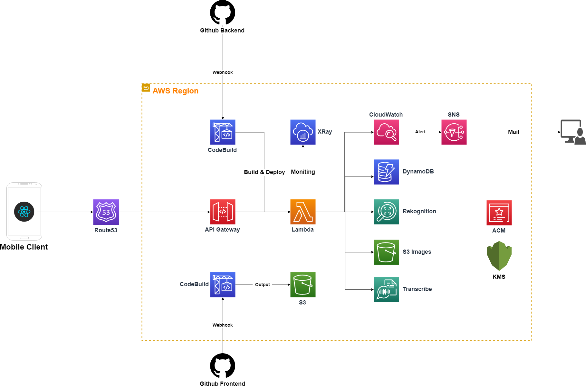

# pocket-cards-docs

## Architecture

## REST API
|Path| Http Method| Function ID| Comment|
---|---|---|---
/regist | POST | A001 |ユーザ登録																		
/login | POST | A002 | ユーザログイン								
/{user}/groups | POST | B001 | グループ登録
/{user}/groups/{groupId}| GET |B001 | グループ情報取得
/{user}/groups/{groupId}| PUT |B001 | グループ情報変更
/{user}/groups/{groupId}| DELETE | B001 |グループ情報削除
/{user}/groups/{groupId}/words| POST |C001 | 単語一括登録						
/{user}/groups/{groupId}/words| GET | C002 |単語一覧取得
/{user}/groups/{groupId}/words/{words}| GET|C003 | 単語情報取得
/{user}/groups/{groupId}/words/{words}| PUT | C004 |単語情報更新
/{user}/groups/{groupId}/words/{words}| DELETE | C005 | 単語情報削除
/{user}/groups/{groupId}/words/{words}/speech	|GET| C006 | word to speech
